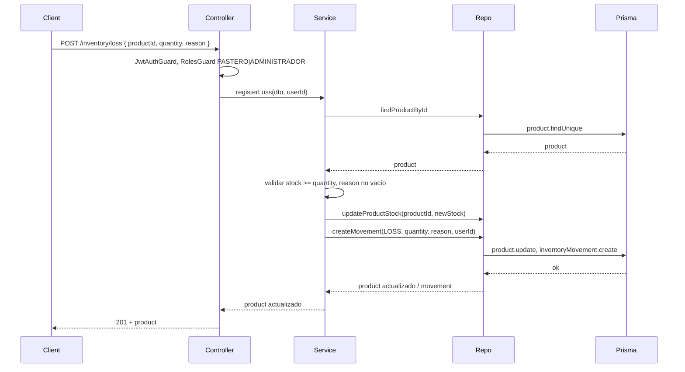

# Plan: Registrar merma de inventario (LOSS)

## Objetivo

Permitir registrar merma de productos (dañados, vencidos, perdidos, inutilizables) descontando stock y creando un movimiento de inventario, **sin** crear órdenes. Acceso para roles **PASTERO** y **ADMINISTRADOR** (en este backend los roles son `PASTERO` y `ADMINISTRADOR`; equivalentes funcionales a pastelero y super admin).

---

## Estado actual

- **Prisma:** [backend/prisma/schema.prisma](pasteleria-app/backend/prisma/schema.prisma) define `InventoryMovementType` con `IN`, `OUT`, `ADJUST`. No existe `LOSS`.
- **Inventario:** [inventory.controller.ts](pasteleria-app/backend/src/modules/inventory/inventory.controller.ts) expone `POST /inventory/movement` (genérico) y `GET /inventory/movements`. No hay endpoint dedicado a merma ni guards de roles en este módulo.
- **Servicio:** [inventory.service.ts](pasteleria-app/backend/src/modules/inventory/inventory.service.ts) en `createMovement` ya valida cantidad, producto y stock para tipo `OUT`; no hay lógica para merma.
- **Repositorio:** [inventory.repository.ts](pasteleria-app/backend/src/modules/inventory/inventory.repository.ts) tiene `findProductById`, `updateProductStock`, `createMovement`. Prisma solo en el repository.

---

## Cambios propuestos

### 1. Prisma: añadir tipo LOSS

- En **schema.prisma**, dentro de `enum InventoryMovementType`, añadir:
  - `LOSS`
- Ejecutar migración:
  - `npx prisma migrate dev --name add_inventory_loss_type`
- Así se distingue merma de OUT (ventas) y de ADJUST (ajustes manuales).

### 2. DTO: body para registrar merma

- **Crear** [backend/src/modules/inventory/dto/register-loss.dto.ts](pasteleria-app/backend/src/modules/inventory/dto/register-loss.dto.ts):
  - `productId: string` (requerido, válido)
  - `quantity: number` (requerido, mínimo 1)
  - `reason: string` (requerido, no vacío después de trim)
- Validaciones con class-validator: `@IsNotEmpty`, `@IsString`, `@Min(1)` para quantity, y para reason `@IsString()` + `@MinLength(1)` o validación custom para que no sea solo espacios. Documentar con `@ApiProperty` para Swagger.

### 3. Service: regla de negocio merma

- En [inventory.service.ts](pasteleria-app/backend/src/modules/inventory/inventory.service.ts) **añadir** método `registerLoss(dto: RegisterLossDto, userId?: string)`:
  1. Validar producto existente (`findProductById`).
  2. Validar `quantity > 0` (el DTO ya lo asegura; opcional re-validar).
  3. Validar stock suficiente: `product.stock >= quantity`; si no, lanzar `BadRequestException` con mensaje claro.
  4. Validar que `reason` esté informado (no vacío/espacios); si no, `BadRequestException`.
  5. Calcular nuevo stock: `newStock = product.stock - quantity`.
  6. Llamar a repository para actualizar stock y crear movimiento en ese orden (o en transacción si se quiere atomicidad).
- **Repository:** usar `updateProductStock(productId, newStock)` y `createMovement({ productId, type: 'LOSS', quantity, reason, userId })`. El tipo `LOSS` será válido tras la migración de Prisma.
- **Retorno:** devolver el producto actualizado (por ejemplo re-fetch `findProductById` tras actualizar, o que el repository devuelva el producto actualizado). La especificación pide "respuesta exitosa con el producto actualizado".

### 4. Repository

- En [inventory.repository.ts](pasteleria-app/backend/src/modules/inventory/inventory.repository.ts):
  - `CreateMovementData` y `createMovement` ya aceptan `type: InventoryMovementType`; tras añadir `LOSS` al enum de Prisma, no hace falta cambiar la firma. Solo se usará `type: 'LOSS'` desde el service.
- Opcional: método `registerLoss(productId, quantity, reason, userId)` que haga update + create en una transacción `prisma.$transaction` para atomicidad. Si no se añade, el service puede llamar dos veces al repository (update y create); si uno falla, podría quedar inconsistencia, por lo que se recomienda transacción.

### 5. Controller: POST /inventory/loss

- En [inventory.controller.ts](pasteleria-app/backend/src/modules/inventory/inventory.controller.ts):
  - Añadir ruta **POST /loss** (ruta `'loss'`).
  - Body: `@Body() dto: RegisterLossDto`.
  - Llamar a `inventoryService.registerLoss(dto, req.user?.id)`.
  - Proteger con **JwtAuthGuard** y **RolesGuard** con roles **PASTERO** y **ADMINISTRADOR** (`@Roles(AppRole.PASTERO, AppRole.ADMINISTRADOR)`).
  - Respuesta 201 con el producto actualizado (o 200 según convención); 400 si validaciones fallan; 404 si producto no existe.
- **Módulo:** [inventory.module.ts](pasteleria-app/backend/src/modules/inventory/inventory.module.ts) debe importar **AuthModule** para poder usar `JwtAuthGuard` y `RolesGuard` (y que el usuario esté en `req.user`).

### 6. Respuesta del endpoint

- Opción A: devolver solo el **producto actualizado** (con `stock` ya descontado). Tipo: producto o un DTO que incluya al menos `id`, `name`, `stock`.
- Opción B: devolver el **movimiento creado** más el producto. La especificación pide "respuesta exitosa con el producto actualizado", por tanto al menos incluir el producto actualizado; si se quiere también el movimiento, se puede extender.

---

## Flujo resumido

---

## Archivos a crear

| Archivo | Descripción |
|--------|-------------|
| [backend/src/modules/inventory/dto/register-loss.dto.ts](pasteleria-app/backend/src/modules/inventory/dto/register-loss.dto.ts) | DTO con productId, quantity, reason (todos requeridos; reason no vacío). |

---

## Archivos a modificar

| Archivo | Cambios |
|--------|---------|
| [backend/prisma/schema.prisma](pasteleria-app/backend/prisma/schema.prisma) | Añadir `LOSS` al enum `InventoryMovementType`. |
| [backend/src/modules/inventory/inventory.service.ts](pasteleria-app/backend/src/modules/inventory/inventory.service.ts) | Añadir `registerLoss(dto, userId?)` con validaciones y llamadas a repository (y opcionalmente transacción en repo). |
| [backend/src/modules/inventory/inventory.repository.ts](pasteleria-app/backend/src/modules/inventory/inventory.repository.ts) | Opcional: método transaccional para update stock + create movement LOSS. |
| [backend/src/modules/inventory/inventory.controller.ts](pasteleria-app/backend/src/modules/inventory/inventory.controller.ts) | Añadir POST `loss`, body RegisterLossDto, guards (JwtAuthGuard, RolesGuard), roles PASTERO y ADMINISTRADOR. |
| [backend/src/modules/inventory/inventory.module.ts](pasteleria-app/backend/src/modules/inventory/inventory.module.ts) | Importar AuthModule para usar los guards. |

---

## Cómo probar manualmente

1. **Migración:** Ejecutar `npx prisma migrate dev --name add_inventory_loss_type` y comprobar que el enum incluye LOSS.
2. **Token:** Iniciar sesión con un usuario con rol PASTERO o ADMINISTRADOR y obtener el JWT.
3. **Registrar merma:**  
   `POST /api/inventory/loss`  
   Headers: `Authorization: Bearer <token>`, `Content-Type: application/json`.  
   Body: `{ "productId": "<id_producto_existente>", "quantity": 2, "reason": "Producto vencido" }`.
4. **Verificar:**  
   - Respuesta 201 con producto actualizado (stock = anterior - quantity).  
   - En BD: `Product.stock` disminuido; existe un `InventoryMovement` con `type: 'LOSS'`, `quantity`, `reason` y `productId`.
5. **Validaciones:** Probar con productId inexistente (404), quantity 0 o negativa (400), reason vacío (400), stock insuficiente (400). Probar sin token o con rol USER/BODEGUERO (403).

---

## Entrega esperada (resumen)

1. **Tipo de movimiento:** LOSS (nuevo valor en enum Prisma).
2. **Endpoint:** `POST /api/inventory/loss` (con prefijo global `api` si existe en main).
3. **DTO:** RegisterLossDto (productId, quantity, reason).
4. **Archivos:** creado register-loss.dto.ts; modificados schema.prisma, inventory.service.ts, inventory.controller.ts, inventory.module.ts; opcional inventory.repository.ts para transacción.
5. **Pruebas:** pasos anteriores para registrar merma, verificar descuento en Product.stock y creación de InventoryMovement LOSS.
